# Assignment 4 - Implement Simplified 3D Gaussian Splatting

## This repositories is WeiLin Liu's implement of of Assignment_04 of DIP.


# Requirements
To install requirements:

```bash
python -m pip install -r requirements.txt
```

# Running

## To finish Task 1 (Structure-from-Motion with COLMAP),run:

```bash
python mvs_with_colmap.py --data_dir data/lego

python debug_mvs_by_projecting_pts.py --data_dir data/lego
```

## To finish Task 2 (Simplified 3D Gaussian Splatting),run:

```bash
python train.py --colmap_dir data/chair --checkpoint_dir data/lego/checkpoints

python render_3dgs_mv.py \
    --colmap_dir data/lego \
    --checkpoint data/chair/checkpoints/checkpoint_000060.pt \
    --num_frames 240 --fps 30
```

## To finish Task 3 (Oficial 3D Gaussian Splatting) please check this website.[官方 3DGS](https://github.com/graphdeco-inria/gaussian-splatting)

## Data
```
data/
└──lego/images/    # 100 张 multi-view 渲染图像
```

# Results and Discusion

## Task 1: Structure-from-Motion with COLMAP

### Projection and Debug figs

<p align="center">
 
</p>

## Task 2: Simplified 3D Gaussian Splatting

### Simplified 3DGS Results

<p align="center">
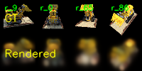

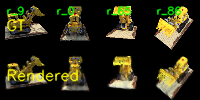

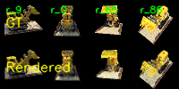
</p>

<p align="center">
[点此观看演示视频](data/lego/debug_rendering.mp4)
</p>

As you can see, as the number of epochs increases (the number of training iterations increases), the clarity of the rendered image gradually increases, becoming more and more faithful to the original image.

We also can have the following files:
```
lego/
├── sparse/
│   └── 0
│       ├──cameras.bin
│       ├──frames.bin
│       └──...
└──databse.db     
```
which is pretty convenient for the next task.

### Task 1 and Task 2 are run based on the following Python environment:
```
    Python 3.11.15(Windows 11)
    Pytorch 2.11.0
    CUDA 12.8
    Device_CPU = " AMD Ryzen 7500F 6-Core Processor "
    Device_GPU = " NVIDIA RTX 5060Ti 8G "
```

## Task 3: Compare with the Official 3DGS Implementation

### This task is run based on the following Python environment:
```
    Python  3.8(ubuntu)
    PyTorch  2.0.0
    CUDA  11.8
    Device_CPU = " AMD EPYC 7T83 64-Core Processor "
    Device_GPU = " NVIDIA RTX 4080 32G "
```
### Output:point cloud

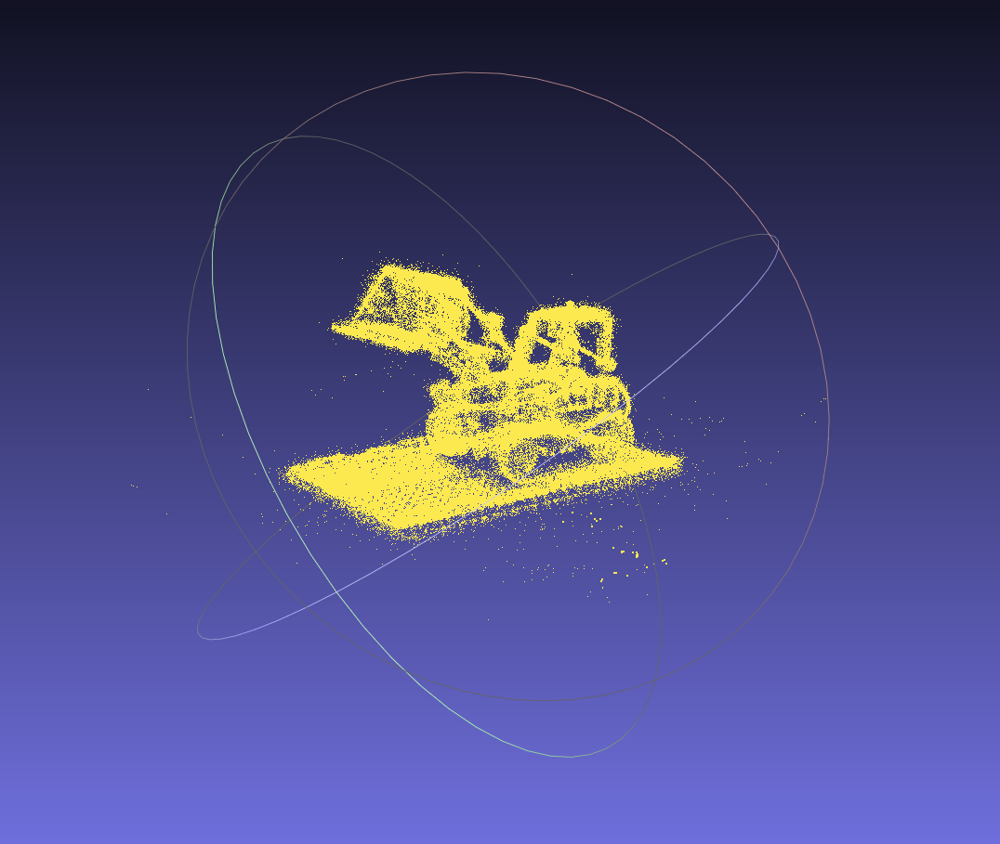

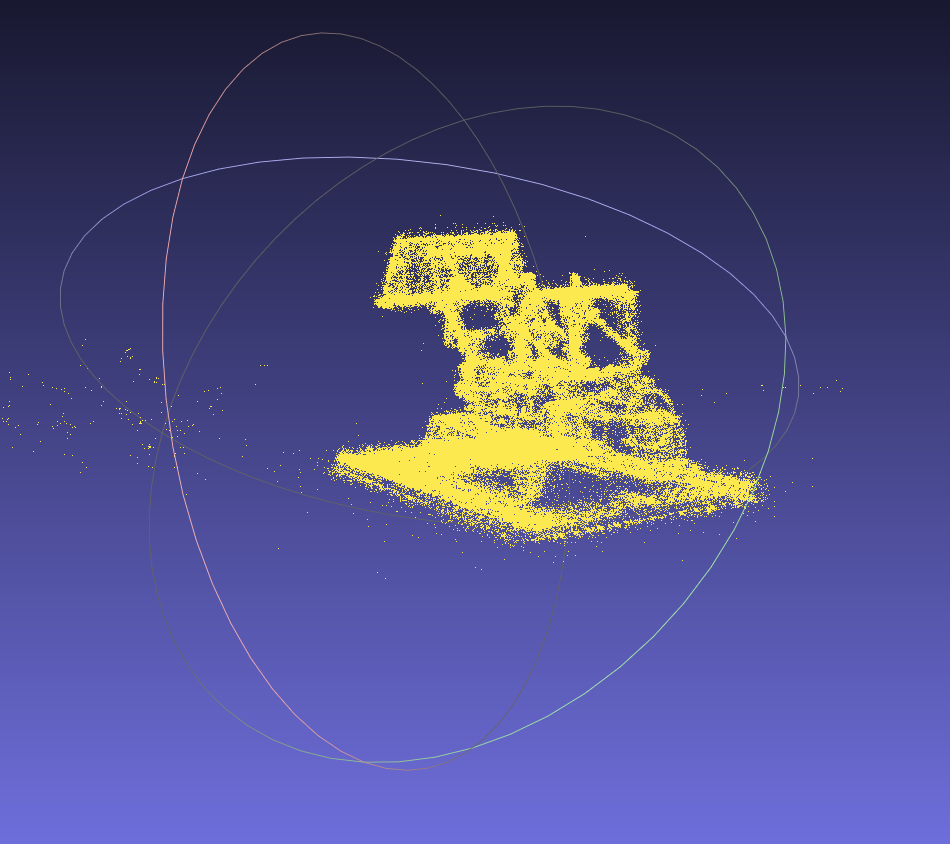

### Rendered figs

The leftside fig is original figs,the rightside fig is rendered figs.

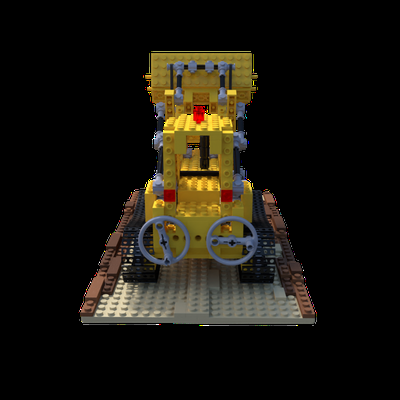 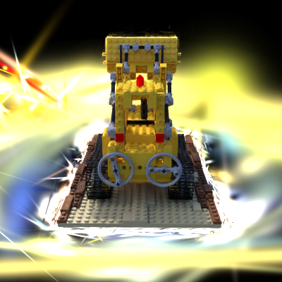

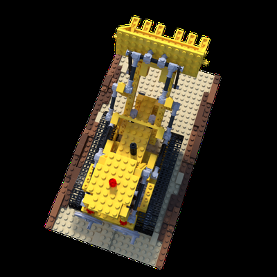 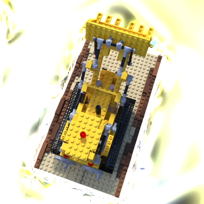

As can be seen, the point cloud and images rendered using the official 3DGS are of extremely high quality, perfectly displaying numerous details of the original image (such as the bumps on the LEGO brick version). Its performance is much higher than the simplified 3DGS implementation in Task 2.

# Code performance comparison

## I. Rendering quality


Clearly, the rendering quality of the official 3DGS is much higher than that of the simplified 3DGS. It is more detailed in its reproduction of details and its processing of high-resolution images, and it can be trained without cropping.

## II. Training speed

Simplified 3DGS training requires about an hour to iterate through all images in the dataset, while according to the saved training log, the official 3DGS only takes about three minutes to complete all training and provide high-quality results.

check[official3DGSTraninglog](official3DGS/log.txt)

## III. Memory usage

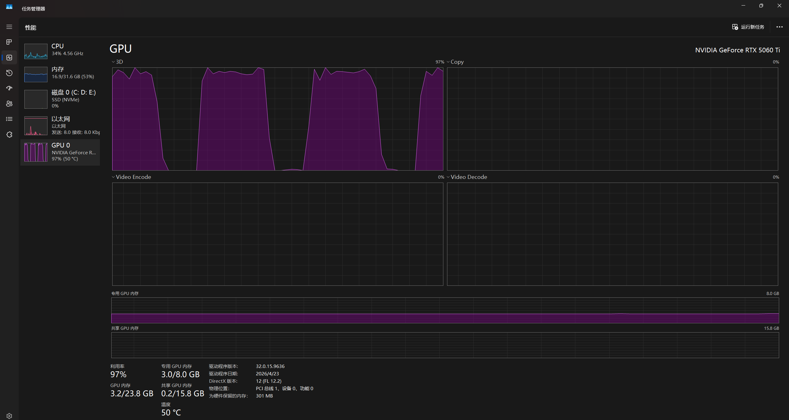

When training with a simplified version of 3DGS, an RTX 5060 Ti with 8GB of VRAM used approximately 3GB of VRAM. 

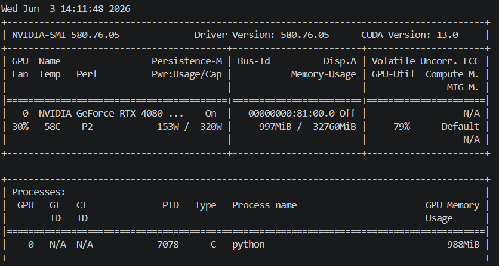

However, when training with the official 3DGS, an RTX 4080 with 32GB of VRAM only used about 1GB of VRAM.

# IV. Discussion on different performance characteristics


